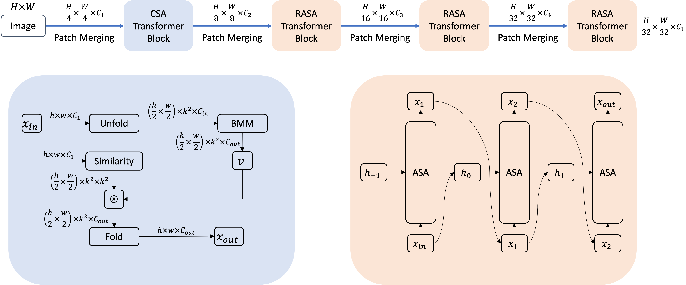

# LVT_Lite Vision Transformer (CVPR 2022)

## Introduction

This repository contains the official implementation of [Lite Vision Transformer with Enhanced Self-Attention](http://arxiv.org/abs/2112.10809).

<p align = "center">

</p>
<p align = "center">
Lite Vision Transformer (LVT). 
</p>

Despite the impressive representation capacity of vision transformer models, current light-weight vision transformer models still suffer from inconsistent and incorrect dense predictions at local regions. We suspect that the power of their self-attention mechanism is limited in shallower and thinner networks. We propose Lite Vision Transformer (LVT), a novel light-weight transformer network with two enhanced self-attention mechanisms to improve the model performances for mobile deployment. For the low-level features, we introduce Convolutional Self-Attention (CSA). Unlike previous approaches of merging convolution and self-attention, CSA introduces local self-attention into the convolution within a kernel of size 3×3 to enrich low-level features in the first stage of LVT. For the high-level features, we propose Recursive Atrous Self-Attention (RASA), which utilizes the multi-scale context when calculating the similarity map and a recursive mechanism to increase the representation capability with marginal extra parameter cost. The superiority of LVT is demonstrated on ImageNet recognition, ADE20K semantic segmentation, and COCO panoptic segmentation.

## Main Results

- ImageNet classification

| Model | Top-1 Acc. | Backbone Params (M) | FLOPs (G) |  Model |
|:-----------:|:--------------:|:------------:|:------------:|:------------:|
LVT | 74.8 | 3.4 | 0.9 | [Download](https://livejohnshopkins-my.sharepoint.com/:u:/g/personal/cyang76_jh_edu/EfRiWkG1IHdCr1fMHcpv4AcBqnfqkrTVI7XVD-tom6Gwwg?e=DSc7sH) |

- ADE20K semantic segmentation

| Method | Encoder | mIoU | Params (M) | FLOPs (G) | FPS (512) <sup>1</sup> | Model |
|:-----------:|:--------------:|:------------:|:------------:|:------------:|:------------:|:------------:|
SegFormer | LVT | 39.3 | 3.9 | 10.6 | 45.5 | [Download](https://livejohnshopkins-my.sharepoint.com/:u:/g/personal/cyang76_jh_edu/ERCKoFH80EREtzvmeTklq6MBa-Iw5nX9IM7w5lwFsW6UjA?e=eNhaf7) |

- COCO panoptic segmentation

| | Method | Backbone | PQ | PQ<sup>th</sup> | PQ<sup>st</sup> | Params (M) | FLOPs (G) | FPS (1333x800) <sup>2</sup> | Model |
|:-----------:|:--------------:|:------------:|:------------:|:------------:|:------------:|:------------:|:------------:|:------------:|:------------:|
| val | Panoptic FPN | LVT | 42.8 | 49.5 | 32.6 | 5.4 | 56.4 | 20.4 | [Download](https://livejohnshopkins-my.sharepoint.com/:u:/g/personal/cyang76_jh_edu/ESd4pNvGu1VGjJ14_XQ1ViABJldEqDmtEH5UAGmBSbm-pA?e=mNGeN5) |
| test-dev | Panoptic FPN | LVT | 43.0 | 49.9 | 32.6 | 5.4 | 56.4 | 20.4 | [Download](https://livejohnshopkins-my.sharepoint.com/:u:/g/personal/cyang76_jh_edu/ESd4pNvGu1VGjJ14_XQ1ViABJldEqDmtEH5UAGmBSbm-pA?e=mNGeN5) |

1. (512): The short side of input is rescaled to 512 with the aspect ratio unchanged.

2. (1333x800): The input is rescaled such that the maximum length does not exceed 1333 and the minimum length 800. The aspect ratio is kept.

> The FPS is calculated on 2000 images on a single NVIDIA V100 GPU.

## Classification Usage

The training and testing commands can be issued in [LVT/classification](/classification).

### Installation

Please refer to [Requirements](https://github.com/sail-sg/volo#1-requirements) to prepare the environment.

### Training:
```bash
CUDA_VISIBLE_DEVICES=0,1,2,3,4,5,6,7 \
./distributed_train.sh 8 /PATH_TO_IMAGENET \
  --model lvt_cls --img-size 224 \
  -b 128 --lr 1.6e-3 --drop-path 0.1 --apex-amp \
  --token-label \
  --token-label-size 7 \
  --token-label-data /home/code-base/data/label_top5_train_nfnet \
  --cfg ./configs/lvt_imagenet.py \
  --output ./work_dirs/
```

### Testing:
+ Before testing, please download the [checkpoint](https://livejohnshopkins-my.sharepoint.com/:u:/g/personal/cyang76_jh_edu/EfRiWkG1IHdCr1fMHcpv4AcBqnfqkrTVI7XVD-tom6Gwwg?e=DSc7sH) and put them in ./checkpoints/.
```bash
python validate.py \
/PATH_TO_IMAGENET  \
  --model lvt_cls \
  --checkpoint checkpoints/lvt_imagenet.pth.tar \
  --no-test-pool \
  --apex-amp \
  --img-size 224 \
  -b 128 \
  --cfg ./configs/lvt_imagenet.py
```

## Sementic Segmentation Usage

The training and testing commands can be issued in [LVT/segmentation](/segmentation).

### Installation

Please refer to [Installation](https://github.com/NVlabs/SegFormer#installation) to prepare the environment.

### Training:
+ Before training, please download the [model](https://livejohnshopkins-my.sharepoint.com/:u:/g/personal/cyang76_jh_edu/EWY2UcHaAPlLkRi7MQvXNWQBAXA8tc_y5No_rCjXnzw97Q?e=YEp3zj) pre-trained on ImageNet and put them in ./pretrained/.
```bash
PORT=29501 \
CUDA_VISIBLE_DEVICES=0,1,2,3,4,5,6,7 \
./tools/dist_train.sh \
configs/lvt/panoptic_fpn_lvt_fpn_3x_coco.py \
8 \
```

### Testing:
+ Before testing, please download the trained [checkpoint](https://livejohnshopkins-my.sharepoint.com/:u:/g/personal/cyang76_jh_edu/ERCKoFH80EREtzvmeTklq6MBa-Iw5nX9IM7w5lwFsW6UjA?e=eNhaf7) and put them in ./checkpoints/.
```bash
CUDA_VISIBLE_DEVICES=0,1,2,3,4,5,6,7 \
bash tools/dist_test.sh \
configs/lvt/panoptic_fpn_lvt_fpn_3x_coco.py \
checkpoints/panoptic_fpn_lvt_fpn_coco.pth \
8 \
  --eval PQ
```

## Panopotic Segmentation Usage

The training and testing commands can be issued in [LVT/detection](/detection).

### Installation

Please refer to [Installation](https://github.com/Chenglin-Yang/mmdet_dev#installation) to prepare the environment.

### Training:
+ Before training, please download the [model](https://livejohnshopkins-my.sharepoint.com/:u:/g/personal/cyang76_jh_edu/EWY2UcHaAPlLkRi7MQvXNWQBAXA8tc_y5No_rCjXnzw97Q?e=YEp3zj) pre-trained on ImageNet and put them in ./pretrained/.
```bash
CUDA_VISIBLE_DEVICES=0,1,2,3,4,5,6,7 \
./tools/dist_train.sh \
local_configs/lvt/segformer.lvt.512x512.ade.160k.py \
8
```

### Testing:
+ Before testing, please download the [checkpoint](https://livejohnshopkins-my.sharepoint.com/:u:/g/personal/cyang76_jh_edu/ESd4pNvGu1VGjJ14_XQ1ViABJldEqDmtEH5UAGmBSbm-pA?e=mNGeN5) and put them in ./checkpoints/.
```bash
python tools/test.py \
local_configs/lvt/segformer.lvt.512x512.ade.160k.py \
./checkpoints/segformer_lvt_ade20k.pth \
  --eval mIoU
```

## Citing LVT

If you find LVT is helpful in your project, please consider citing our paper.

```BibTeX
@article{yang2021lite,
  title={Lite Vision Transformer with Enhanced Self-Attention},
  author={Yang, Chenglin and Wang, Yilin and Zhang, Jianming and Zhang, He and Wei, Zijun and and Yuille, Alan},
  journal={arXiv preprint arXiv:2112.10809},
  year={2021}
}
```
## License
Please see the license file, if you have further questions contact Yilin Wang 

## Credits

Image classification code is based on [VOLO](https://github.com/sail-sg/volo).
Semantic segmentation code is based on [SegFormer](https://github.com/NVlabs/SegFormer).
Panoptic segmentation code is based on [mmdetection](https://github.com/open-mmlab/mmdetection).
Part of modules are based on [PVT](https://github.com/whai362/PVT) and [Dynamic-convolution-Pytorch](https://github.com/kaijieshi7/Dynamic-convolution-Pytorch).
